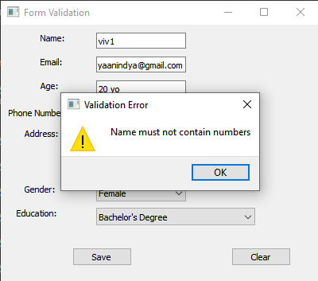
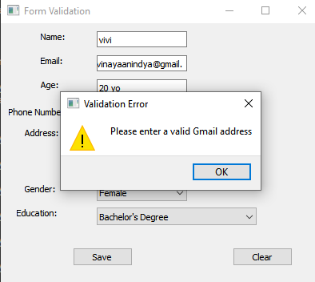
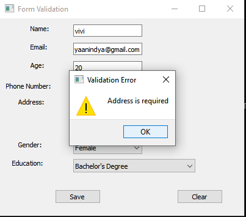
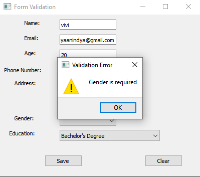
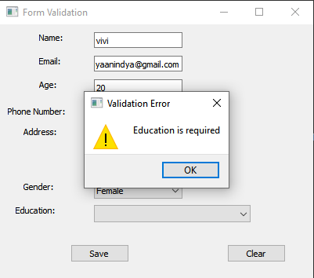

# pv25-week5

Berikut adalah tampilan dan bagian-bagian dari form validation app:

## 1. Tampilan Awal

## 2. Input Nama

## 3. Input Email

## 4. Input Umur

## 5. Input No HP

## 6. Input Alamat

## 7. Input Gender

## 8. Input Education

## 9. Setelah Data Disimpan

## 10. Tampilan Akhir

